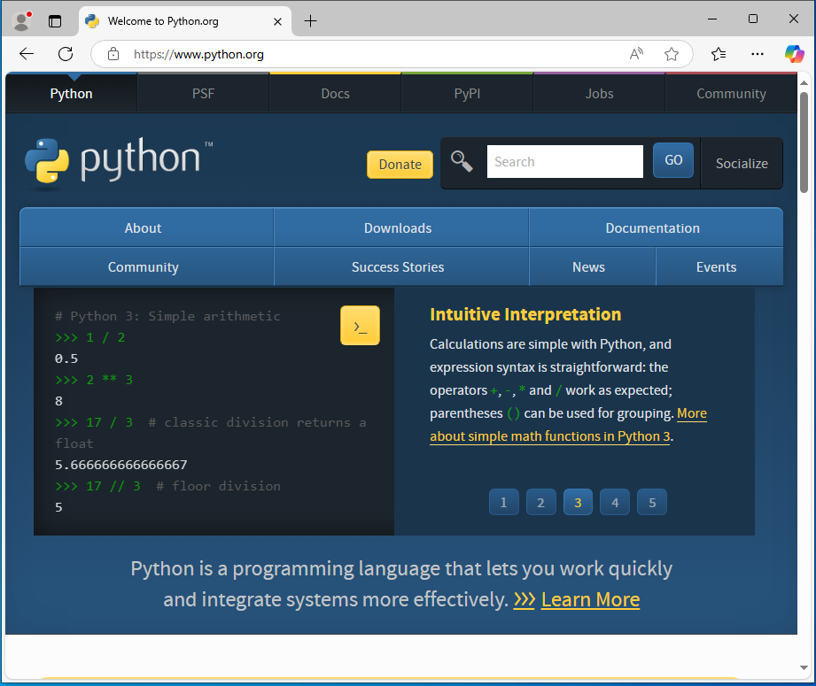
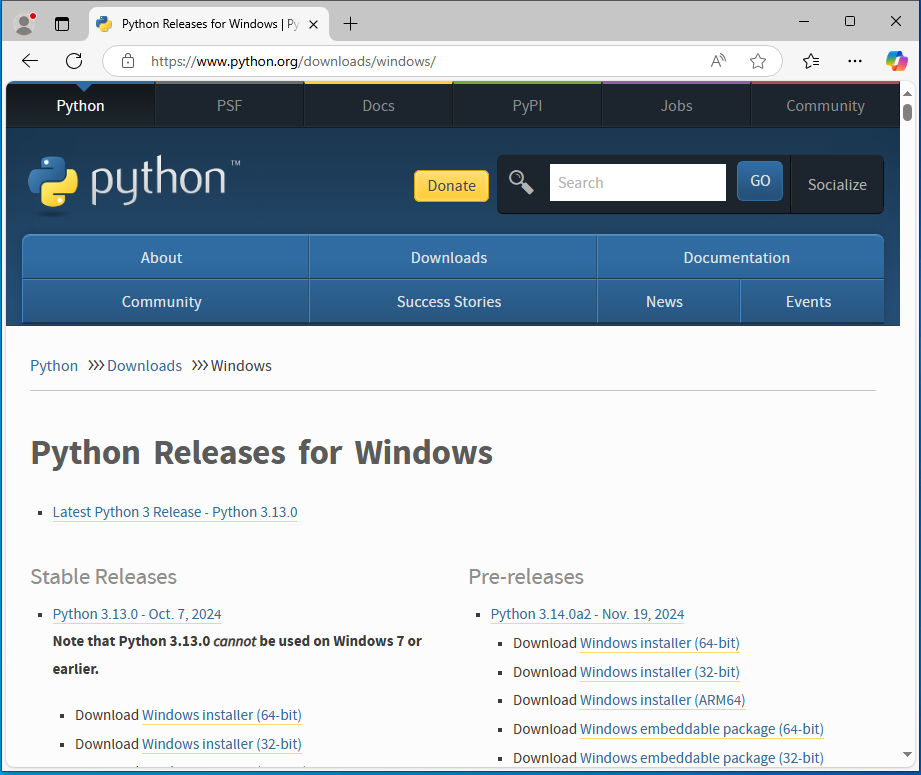
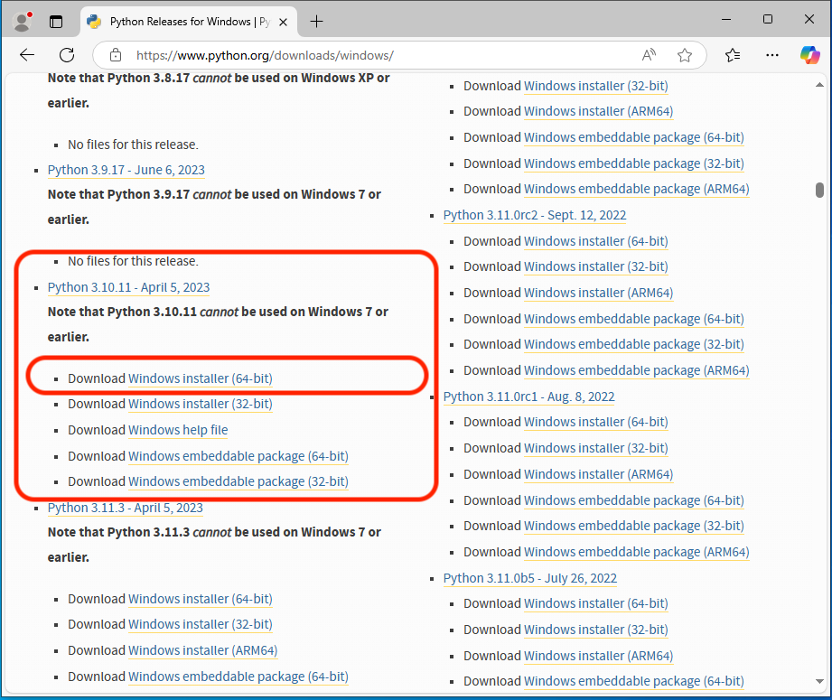
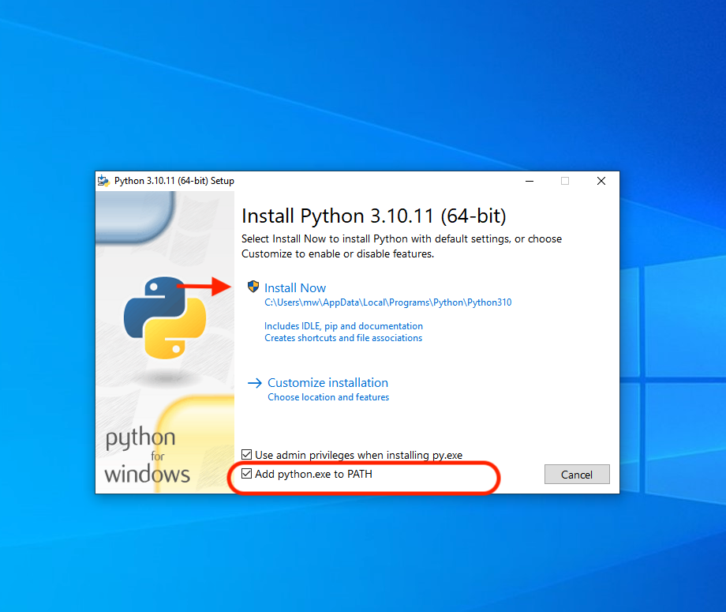

Install Python3
===============
MountWizzard4 is a python3 application based on some python libraries and uses
Qt5/6 as framework for GUI. Different to past versions of MountWizzard4 there
will be no one box solution (MAC bundle, EXE File, etc.) available. As
MountWizzard4 is python3 and comes with internal update functionality, it uses
a standard python3 environment. Ideally it is recommended in a virtualenv.

The first step is to install the appropriate python3 package if not already
installed. For all platforms installer are available. Please look here:

And the link to the python website: https://www.python.org.

Please follow the descriptions that comes with the installers. To give
a short overview here are some quick installation hints for all platforms.

.. warning::
    Please do not use a newer version of python than recommended for the
    MountWizzard4 version you would like to use. Some libraries bring
    precompiled binaries with them and they might not be available for a newer
    python version.

If there is already an appropriate python3 installed, you can skip this section
and go directly to the MountWizzard4 installation process. If you have to
install python3 this has to be done only once for as many MountWizzard4
installations you might want.

There are videos for multiple use cases on the youtube channel:
https://www.youtube.com/channel/UCJD-5qdLEcBTCugltqw1hXA

.. note::
    On windows there are some new features which supports comet, earth rotation
    and asteroids update for the mount. These functions are available from
    python 3.8.2 on. Earlier python versions have issues. If you would like to
    upgrade an older python installation, please see the comments below for
    windows. On other OS there is no need for doing that.

    The actual recommended python version for MountWizzard4 is 3.10.

Windows Platform
----------------
.. note::
    Windows makes a hard split between 32bit and 64bit versions. If your drivers
    and setup uses 64bit solutions, please install 64bit python!

Depending on your Windows version please download the installer for python3 from:

https://www.python.org/downloads/windows/

Switch to the windows part

choose the appropriate installer,

and follow the installation procedure.

.. hint::
    Please take care that during the installation the checkbox "Add Python.exe
    to Path" is selected and to install for a single user if you want to use the
    scripts.

MountWizzard4 does not need admin rights to run!

Mac OSx platform
----------------
Depending on your OSx version please download the installer for python3 from:

https://www.python.org/downloads/mac-osx/

and follow the installation procedure. MountWizzard4 does not need admin rights
to run!

.. warning::
    Using a Mac with Apple silicon need special treatment. There is rather any
    experience with these setups. Actually MountWizzard4 only support Intel
    architecture so you need to use the Rosetta emulator.

Ubuntu platform
---------------
Referring to Ubuntu 20.04 LTS as it comes with python3.8. This should work, but
you could upgrade to a newer python3 version. This could be done by adding an
appropriate repo, which enables this version.

.. hint::
    If you update to a higher python version, please update to the latest
    supported python3 version (3.10 for MountWizzard4 3.x and 3.12 for
    MountWizzard4 4.x). There are many descriptions out, so please search for it
    in case you don't know exactly.

An example is from:
https://linuxize.com/post/how-to-install-python-3-7-on-ubuntu-18-04/

.. code-block:: python

    sudo add-apt-repository ppa:deadsnakes/ppa
    sudo apt-get update
    sudo apt-get upgrade
    sudo apt-get install python3.10

Please check the right version and the availability of virtualenv in your setup.
If virtualenv is not present in your setup, please install it prior to run the
install scripts with:

.. code-block:: python

    sudo apt-get install python3-virtualenv
